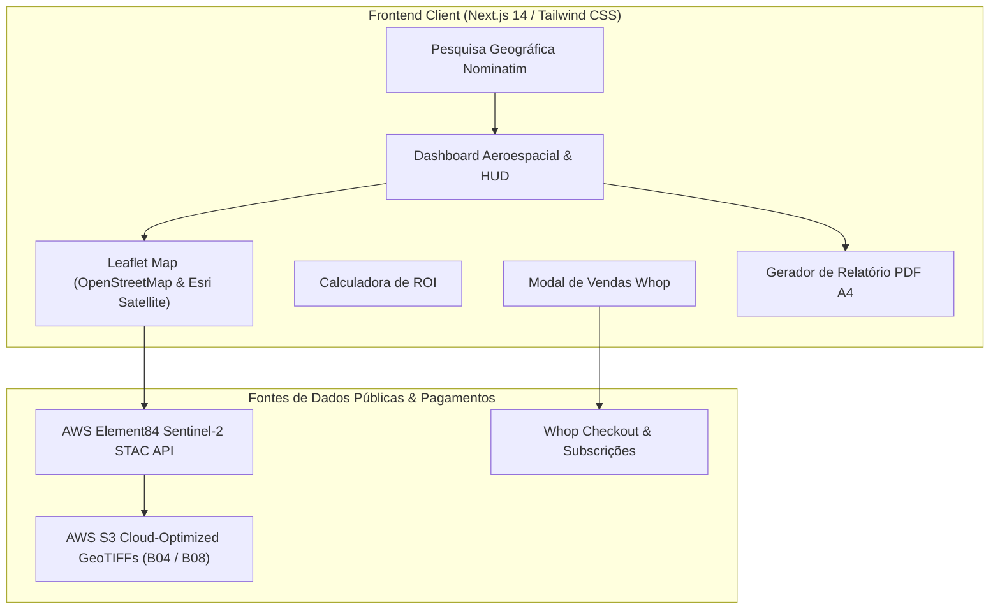

<div align="center">

# 🛰️ CropVision SaaS
### **Agricultural Earth Observation & Satellite NDVI Intelligence**

[](https://miguel-galrito.github.io/sat-health-api/)
[](https://whop.com/cropvision/cropvision-starter/)
[](https://whop.com/cropvision/cropvision-pro-enterprise/)
[](https://nextjs.org/)
[](https://fastapi.tiangolo.com/)
[](https://sentinels.copernicus.eu/)
[](LICENSE)

<p align="center">
  <b>Micro-SaaS comercial de alta fidelidade para observação da Terra, diagnóstico agronómico de vigor vegetal, cálculo vetorizado de NDVI em tempo real e relatórios executivos para agricultura de precisão via Copernicus Sentinel-2 STAC.</b>
</p>

> [!TIP]
> ### 🌍 Aplicação Interativa em Produção
> Clique em qualquer parcela agrícola, vinha ou olival no globo para analisar a telemetria do dossel e descarregar relatórios executivos:
> 👉 **[https://miguel-galrito.github.io/sat-health-api/](https://miguel-galrito.github.io/sat-health-api/)**

[Planos & Monetização](#-planos-comerciais--monetização-whop) •
[Funcionalidades](#-funcionalidades-chave) •
[Calculadora de ROI](#-calculadora-de-roi-agrícola) •
[Arquitetura](#-arquitetura-do-sistema) •
[Início Rápido](#-início-rápido) •
[Deploy](#-deploy-em-produção-custo-zero)

</div>

---

## 💎 Planos Comerciais & Monetização (Whop)

A monetização do **CropVision SaaS** opera através da **Whop**, proporcionando uma infraestrutura de checkout e gestão de membros sem qualquer custo fixo mensal (apenas 3% de taxa sobre vendas):

### 1. CropVision Starter — 49.00 € / mês
👉 **[Subscrever Plano Starter na Whop](https://whop.com/cropvision/cropvision-starter/)**
- **Indicado para**: Pequenos produtores agrícolas, viticultores e consultores agronómicos independentes.
- **Capacidades**:
  - Até 10 parcelas agrícolas monitorizadas
  - 1.000 requisições de satélite / mês
  - Telemetria de NDVI zonal e diagnóstico de vigor
  - Resolução espacial ótica de 10 metros
  - Atualização com passagem orbital a cada 5 dias
  - Exportação de relatórios de campo

### 2. CropVision Pro Enterprise — 149.00 € / mês *(Mais Popular)*
👉 **[Subscrever Plano Pro Enterprise na Whop](https://whop.com/cropvision/cropvision-pro-enterprise/)**
- **Indicado para**: Grandes herdades, agroindústrias, cooperativas e empresas de agro-tecnologia (AgTech).
- **Capacidades**:
  - **Talhões e herdades ilimitadas**
  - Até 10.000 requisições de satélite / mês
  - **Exportação de Relatórios PDF Executivos A4 sem marca de água**
  - Telemetria espectral avançada (NDVI Colormap, RGB True Color e estatísticas de dispersão)
  - Histórico orbital multitemporal e tendências de vigor
  - Acesso direto à API REST para integração com ERPs agrícolas

### 🛡️ Paywall Suave Integrado:
- Utilizadores gratuitos desfrutam de até **3 consultas de coordenadas por dia**.
- No 4º ponto ou na tentativa de exportar o Relatório PDF Executivo sem restrições, abre-se o modal de conversão Whop.
- Suporte secundário a pagamento com cartão de crédito via Stripe Checkout.

---

## 🚜 Calculadora de ROI Agrícola Interativa

Integrada diretamente na interface de utilizador, permite ao agricultor mover um slider com a área da sua herdade (50 a 5.000 hectares) e visualizar o retorno financeiro anual estimado:
- **Otimização de Fertilizantes**: ~24 € / ha / ano através de taxas variáveis orientadas por NDVI.
- **Eficiência de Rega**: ~18 € / ha / ano com deteção antecipada de stress hídrico.
- **Prevenção de Perdas por Pragas**: ~32 € / ha / ano com janelas de intervenção antecipada.
- *Exemplo*: Numa exploração de 500 ha, a poupança estimada atinge **37.500 € / ano**, representando um **retorno de 21x** sobre o investimento anual no plano Pro Enterprise.

---

## ✨ Funcionalidades Chave

- 🛰️ **Pipeline 100% Standalone & Serverless**:
  - Executa diretamente no navegador consultando o catálogo público AWS Element84 Sentinel-2 STAC (`sentinel-2-l2a`).
  - Deploy estático imediato no GitHub Pages ou Vercel com **0 € de custo de infraestrutura**.
- 🧪 **Núcleo Científico Rigoroso & Deteção de Biomas/Água**:
  - Cálculo matricial exato de NDVI:
    $$\text{NDVI} = \frac{\text{B8 (NIR)} - \text{B4 (Red)}}{\text{B8 (NIR)} + \text{B4 (Red)}}$$
  - Preservação estrita da classificação de corpos de água: oceanos e massas de água geram valores negativos (-0.35) com diagnóstico `"Water Body / Saturated Zone"`.
- 🔍 **Pesquisa Geográfica Mundial (Nominatim)**:
  - Barra de pesquisa integrada com auto-complete rápido e cache para encontrar qualquer cidade, região ou herdade no mundo.
- 🎨 **Design Aeroespacial Dark Emerald**:
  - Fundo grafite profundo (`#090d16`), acentos verde esmeralda satélite com luminescência e badge dinâmico orbital `SENTINEL-2 L2A ORBIT: LIVE`.
- 🖨️ **Exportador de Relatórios Executivos A4**:
  - Geração de relatórios PDF executivos de alta resolução com cabeçalho oficial CropVision, mapa de calor, fotografia ótica em cores reais, estatísticas zonais e histórico de passagens orbitais.

---

## 🏛️ Arquitetura do Sistema



---

## ⚡ Início Rápido

### Método 1: Launchers de 1 Clique para Windows
- **Opção A**: Duplo-clique em [`start.bat`](start.bat).
- **Opção B**: No PowerShell:
  ```powershell
  .\start.ps1
  ```

### Método 2: Frontend Standalone
```bash
cd frontend
npm install
npm run dev
# Abra http://localhost:3000
```

### Método 3: Build de Produção
```bash
cd frontend
npm run build
```

---

## 🌐 Deploy em Produção (Custo Zero)

Como o CropVision SaaS foi desenhado para ser 100% standalone:
1. Faça fork ou clone deste repositório.
2. No GitHub, vá a **Settings > Pages > Build and deployment** e selecione **GitHub Actions**.
3. O workflow automático em `.github/workflows/deploy.yml` constrói o frontend e publica o micro-SaaS gratuitamente com SSL ativo.

---

## 📄 Licença
Distribuído sob a licença **MIT**. Consulte o ficheiro [LICENSE](LICENSE) para mais detalhes.
