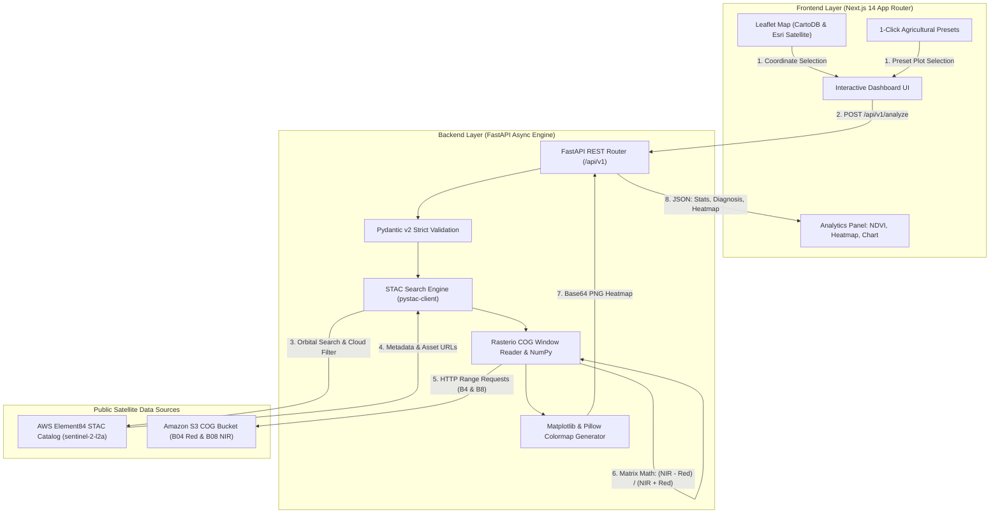

<div align="center">

# 🛰️ SatHealth API & Dashboard
### **Earth Observation Intelligence & Automated Crop Vigor Monitoring Micro-SaaS**

[](https://miguel-galrito.github.io/sat-health-api/)
[](https://fastapi.tiangolo.com/)
[](https://nextjs.org/)
[](https://www.typescriptlang.org/)
[](https://www.python.org/)
[](https://www.docker.com/)
[](https://sentinels.copernicus.eu/)
[](LICENSE)

<p align="center">
  <b>Production-grade B2B Earth Observation micro-SaaS for automated agricultural vegetation health monitoring, zonal canopy statistics, and NDVI calculation via open Copernicus Sentinel-2 satellite data.</b>
</p>

### 🔗 Public Live Application
👉 **[https://miguel-galrito.github.io/sat-health-api/](https://miguel-galrito.github.io/sat-health-api/)**

[Features](#-key-features) •
[Architecture](#-system-architecture) •
[API Documentation](#-api-documentation-post-apiv1analyze) •
[Quick Start](#-quick-start) •
[Production Deployment](#-production-deployment) •
[License](#-license)

</div>

---

## 🌿 Overview

**SatHealth** is a cloud-native Earth Observation (EO) platform designed for precision agriculture, crop consultants, and forestry managers. 

When a user selects coordinates or an agricultural plot on the interactive map, the system queries the open **Copernicus Sentinel-2 (Level-2A Bottom-of-Atmosphere)** STAC catalog, streams only the required spatial window of Band 4 (Red) and Band 8 (Near-Infrared) via **HTTP Range Requests** on Cloud Optimized GeoTIFFs (COGs), computes the **Normalized Difference Vegetation Index (NDVI)** matrix using NumPy, and renders agronomic insights alongside a colorized spectral colormap heatmap.

---

## ✨ Key Features

- 🛰️ **Serverless & Lightweight Geospatial Pipeline**:
  - Spatial window extraction via `rasterio` (~500m/1000m buffer) without downloading multi-hundred-megabyte GeoTIFF files.
  - Queries AWS Element84 open STAC catalog (`sentinel-2-l2a`) with zero proprietary API fees.
- 📊 **Vectorized Matrix NDVI Calculation**:
  $$\text{NDVI} = \frac{\text{B8 (NIR)} - \text{B4 (Red)}}{\text{B8 (NIR)} + \text{B4 (Red)}}$$
  - Full zonal canopy statistics: **Mean, Median, Minimum, Maximum, and Standard Deviation** (spatial canopy homogeneity).
- 🎨 **Server-Generated Colormap Heatmap**:
  - Dynamically renders Base64 Data URI PNG heatmaps using the agronomic `RdYlGn` spectral colormap (Bare Soil $\rightarrow$ Moisture Deficit $\rightarrow$ Moderate $\rightarrow$ Healthy Vigor).
  - Side-by-side comparison between **True Color (RGB)** and **NDVI Spectral Heatmap**.
- 🗺️ **Interactive Geospatial Dashboard (Next.js 14 + Leaflet)**:
  - Toggle between CartoDB Voyager street map and high-resolution Esri World Imagery (satellite).
  - Radar-pulsing target marker and bounding box overlay illustrating the sampled plot footprint.
  - **1-Click Demo Agricultural Presets**:
    - *Esporão Estate* (Alentejo, Portugal) - Vineyards & Olive Groves.
    - *Cerrado Farm* (Sorriso, Mato Grosso, Brazil) - Large-Scale Soybean & Corn.
    - *Central Valley* (Fresno, California, USA) - Drip-Irrigated Almond & Citrus.
    - *Quinta do Vallado* (Douro Valley, Portugal) - Terraced Hillside Vineyards.
    - *Alqueva Reservoir* (Portugal) - Open Water Body Calibrator.
- 📈 **Historical Multi-Temporal Trend**:
  - Interactive SVG trend chart visualizing vegetation evolution across recent orbital passes.
- 🛡️ **Resilience & Robust Error Handling**:
  - Strict `HTTP 422` structured responses when cloud cover exceeds the user threshold (`max_cloud_cover`), returning corrective actions.
  - Calibrated offline simulation fallback to maintain uninterrupted service during public cloud network throttles.
- 📥 **Export Reports**: Instant technical report download in JSON format.

---

## 🏛️ System Architecture



---

## 📡 API Documentation: `POST /api/v1/analyze`

The `/api/v1/analyze` endpoint processes geospatial coordinates, streams Sentinel-2 Level-2A bands, and returns zonal NDVI metrics with an interpreted agronomic diagnosis.

### HTTP Request
`POST /api/v1/analyze`

#### Headers
| Header | Value | Description |
|---|---|---|
| `Content-Type` | `application/json` | Request payload format |
| `Accept` | `application/json` | Response format |

#### Request Body Parameters (`AnalyzeRequest`)
| Field | Type | Required | Default | Range / Format | Description |
|---|---|---|---|---|---|
| `lat` | `float` | **Yes** | — | `[-90.0, 90.0]` | Latitude in decimal degrees (WGS84). |
| `lon` | `float` | **Yes** | — | `[-180.0, 180.0]` | Longitude in decimal degrees (WGS84). |
| `max_cloud_cover` | `float` | No | `20.0` | `[0.0, 100.0]` | Maximum acceptable scene cloud cover percentage. |
| `buffer_meters` | `float` | No | `500.0` | `[100.0, 5000.0]` | Spatial analysis radius in meters around the coordinate. |
| `date_from` | `string` | No | `120 days ago` | `YYYY-MM-DD` | Start of temporal search window (ISO 8601). |
| `date_to` | `string` | No | `today` | `YYYY-MM-DD` | End of temporal search window (ISO 8601). |

#### Example cURL Request
```bash
curl -X POST "http://localhost:8000/api/v1/analyze" \
  -H "Content-Type: application/json" \
  -d '{
    "lat": 38.3842,
    "lon": -7.5519,
    "max_cloud_cover": 20.0,
    "buffer_meters": 500.0
  }'
```

---

### Response Specification (`AnalyzeResponse`)

#### Success Response (`200 OK`)
```json
{
  "success": true,
  "scene_id": "S2C_29SPC_20260902_0_L2A",
  "platform": "Sentinel-2",
  "acquisition_date": "2026-09-02T11:20:41.806000Z",
  "cloud_cover_percentage": 0.0,
  "sun_elevation": 58.42,
  "coordinates": {
    "lat": 38.3842,
    "lon": -7.5519
  },
  "bbox": [
    -7.557621,
    38.379708,
    -7.546179,
    38.388692
  ],
  "resolution_meters": 10.0,
  "pixels_analyzed": 10000,
  "ndvi": {
    "mean": 0.6751,
    "min": 0.1245,
    "max": 0.8842,
    "std": 0.0983,
    "median": 0.6812,
    "p25": 0.6120,
    "p75": 0.7431
  },
  "interpretation": {
    "category": "dense_vegetation",
    "label": "Dense Healthy Vegetation",
    "badge_color": "emerald",
    "description": "Vigorous crop canopy with high leaf area index and intense photosynthetic activity.",
    "recommendation": "Ideal growth conditions. Maintain current irrigation schedule and nutrition plan."
  },
  "thumbnail_url": "data:image/png;base64,iVBORw0KGgoAAAANSUhEUgAAA...",
  "true_color_thumbnail": "https://sentinel-cogs.s3.us-west-2.amazonaws.com/.../thumbnail.jpg",
  "is_simulated": false,
  "processing_time_ms": 7567.87
}
```

#### Response Field Descriptions
| Field | Type | Description |
|---|---|---|
| `success` | `boolean` | `true` if processing succeeded. |
| `scene_id` | `string` | Unique Copernicus Sentinel-2 L2A granule ID. |
| `platform` | `string` | Satellite instrument identifier (`Sentinel-2A`, `Sentinel-2B`, `Sentinel-2C`). |
| `acquisition_date` | `string` | Satellite pass timestamp in UTC (ISO 8601). |
| `cloud_cover_percentage` | `float` | Evaluated cloud contamination across the granule. |
| `sun_elevation` | `float` | Solar elevation angle at acquisition time. |
| `coordinates` | `object` | Target center `{ "lat": float, "lon": float }`. |
| `bbox` | `array` | Bounding box `[min_lon, min_lat, max_lon, max_lat]`. |
| `resolution_meters` | `float` | Ground sample distance (`10.0` meters for Bands 4 & 8). |
| `pixels_analyzed` | `integer` | Count of spatial raster cells inside the sampling window. |
| `ndvi.mean` | `float` | Area-weighted mean NDVI value (`-1.0` to `1.0`). |
| `ndvi.min` / `max` | `float` | Minimum and maximum pixel values in the plot. |
| `ndvi.std` | `float` | Standard deviation measuring spatial crop homogeneity. |
| `ndvi.median` / `p25` / `p75` | `float` | Percentile distribution metrics. |
| `interpretation.label` | `string` | Agronomic classification label. |
| `interpretation.recommendation` | `string` | Actionable recommendation for farm management. |
| `thumbnail_url` | `string` | Base64-encoded PNG data URI containing the colorized colormap heatmap. |
| `true_color_thumbnail` | `string` | URL to the original Sentinel-2 true-color overview thumbnail. |
| `is_simulated` | `boolean` | `false` for live S3 streaming; `true` if fallback was engaged. |
| `processing_time_ms` | `float` | Total execution latency in milliseconds. |

---

### Error Responses

#### Cloud Cover Exceeded (`422 Unprocessable Entity`)
Returned when all candidate scenes exceed `max_cloud_cover`:
```json
{
  "detail": {
    "error": "CLOUD_COVER_EXCEEDED",
    "message": "The lowest cloud cover available for recent scenes is 34.2%, which exceeds the configured maximum threshold of 20.0% (Acquired: 2026-08-30T11:25:00Z).",
    "lowest_cloud_cover": 34.2,
    "max_threshold": 20.0,
    "scene_date": "2026-08-30T11:25:00Z",
    "recommendation": "Increase the cloud cover tolerance threshold or select a wider historical date range."
  }
}
```

#### No Scenes Found (`404 Not Found`)
```json
{
  "detail": {
    "error": "NO_SCENES_FOUND",
    "message": "No Sentinel-2 satellite scenes were found for coordinates (0.0000, 0.0000).",
    "recommendation": "Verify that target coordinates correspond to a land surface covered by Sentinel-2 orbit swaths."
  }
}
```

---

## ⚡ Quick Start

### Method 1: Docker Compose (All-in-One)

```bash
# Clone the repository
git clone https://github.com/Miguel-Galrito/sat-health-api.git
cd sat-health-api

# Start backend and frontend containers
docker-compose up --build
```

- **Frontend Application**: [http://localhost:3000](http://localhost:3000)
- **Interactive Swagger API Docs**: [http://localhost:8000/api/v1/docs](http://localhost:8000/api/v1/docs)
- **Health Verification**: [http://localhost:8000/api/v1/health](http://localhost:8000/api/v1/health)

---

### Method 2: Local Development Setup

#### 1. Backend Setup (FastAPI & Python 3.11+)
```bash
cd backend

# Create and activate virtual environment
python -m venv .venv
source .venv/bin/activate       # On Linux / macOS
# On Windows PowerShell:
.venv\Scripts\Activate.ps1

# Install dependencies
pip install -r requirements.txt

# Run the FastAPI server
python -m uvicorn app.main:app --reload --port 8000
```

#### 2. Frontend Setup (Next.js 14)
Open a separate terminal window:
```bash
cd frontend

# Install dependencies
npm install

# Start development server
npm run dev
```
Open [http://localhost:3000](http://localhost:3000) in your browser.

---

## 🧪 Automated Testing

Execute the comprehensive test suite verifying mathematics, validation, and endpoint integration:

```bash
cd backend
$env:PYTHONPATH="backend"; pytest tests/ -v
```

```text
============================= test session starts =============================
collected 9 items

backend/tests/test_api.py::test_health_endpoint PASSED                   [ 11%]
backend/tests/test_api.py::test_root_endpoint PASSED                     [ 22%]
backend/tests/test_api.py::test_ndvi_matrix_calculation_dense_vegetation PASSED [ 33%]
backend/tests/test_api.py::test_ndvi_matrix_calculation_bare_soil PASSED [ 44%]
backend/tests/test_api.py::test_ndvi_matrix_calculation_water PASSED     [ 55%]
backend/tests/test_api.py::test_colormap_thumbnail_generation PASSED     [ 66%]
backend/tests/test_api.py::test_analyze_validation_errors PASSED         [ 77%]
backend/tests/test_api.py::test_analyze_endpoint_real_or_fallback PASSED [ 88%]
backend/tests/test_api.py::test_timeseries_endpoint PASSED               [100%]

======================= 9 passed in 23s ========================
```

---

## 🚀 Production Deployment

### 1. Frontend on GitHub Pages
This repository includes an automated GitHub Actions deployment workflow:
[`.github/workflows/deploy-pages.yml`](.github/workflows/deploy-pages.yml).

Every push to the `main` branch automatically triggers Next.js static compilation and publishes the dashboard to:
**[https://miguel-galrito.github.io/sat-health-api/](https://miguel-galrito.github.io/sat-health-api/)**

### 2. Backend on Railway / Render / AWS ECS
The backend includes a production-ready multi-stage [`Dockerfile`](backend/Dockerfile) with GDAL and C++ libraries pre-configured:
1. Connect this repository to **Railway** or **Render**.
2. Set the Root Directory to `backend`.
3. Set environment variables:
   - `ENVIRONMENT=production`
   - `DEBUG=False`
   - `CORS_ORIGINS=https://miguel-galrito.github.io,https://your-domain.com`

---

## 📜 License

This project is licensed under the terms of the [MIT License](LICENSE).

<div align="center">
  <sub>Engineered for precision agriculture and automated satellite Earth Observation.</sub>
</div>
